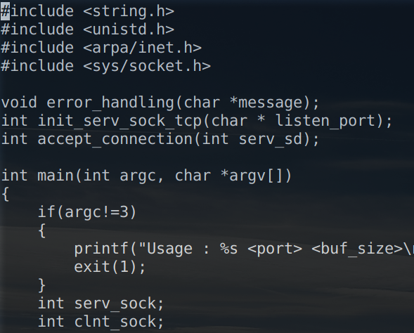
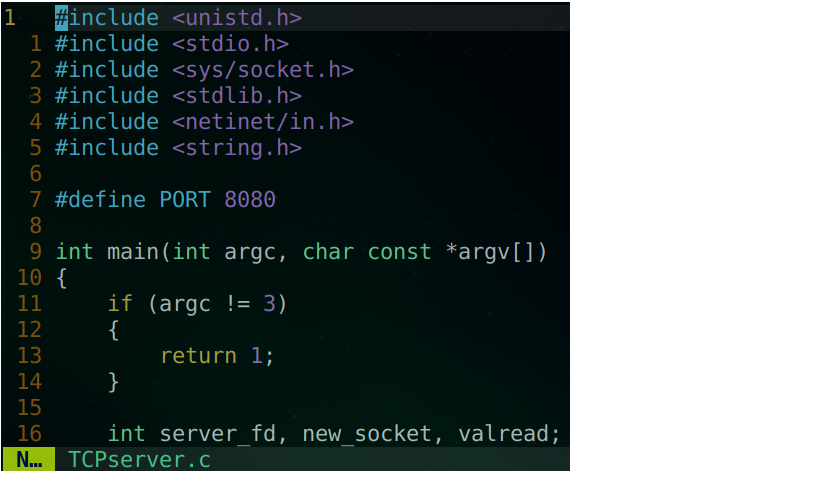

# standalone vim/tmux

This is a standalone vim and tmux binary bundle with library hooking for people who cannot install vim and tmux in normal way.

## target OS

- **Linux x86_64**

## Usage

```shell
git clone https://github.com/ccss17/standalone
cd standalone
./setup.sh
```

##### FROM 



##### TO 


